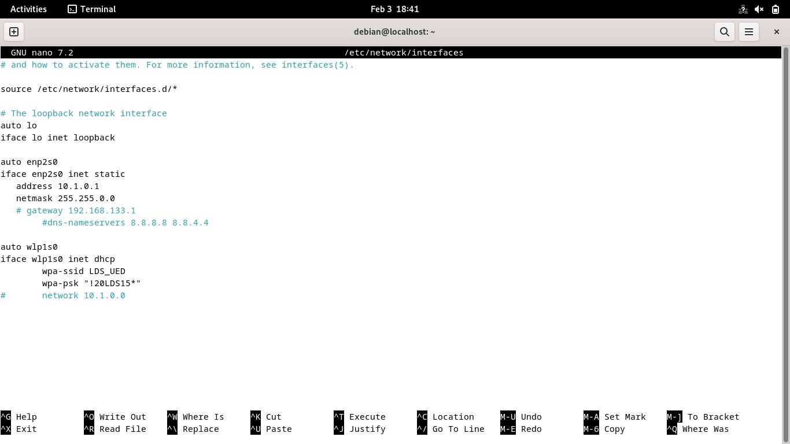

# Trabalho 2

# 1. Integrantes

|Nome|Matrícula|
| -- | -------- |
|Christian Hirsch Santos | 211045113 |
|Eduardo Rodrigues de Farias| 190086521 |
|Ian Lucca Soares Mesquita| 211045140 |
|Kauã Vinícius Ponte Aguiar| 211029399|

## 2. SO Usado

O sistema operacional utilizado foi o Debian, versão 12.5.0.

## 3. Aplicações demandadas na implementação da rede LAN
Para realizar a demanda, foi necessário as seguintes ferramentas:
* Configuração de rede: 
  * `ip addr`, `nano`, `cat`
  * `/etc/network/interfaces`
  * `/etc/sysctl.conf`
* Configuração de NAT: 
  * `iptables`
* Configuração de DHCP: 
  * `/etc/default/isc-dhcp-server`
  * `/etc/dhcp/dhcpd.conf` 
* Testes de validação:
  * `ping`, `arp`, `netstat`,`tracert`, `tcpdump`

## 4. Implementação da rede LAN
A princípio, foi requisitado com que fosse implementado a seguinte rede LAN com as configurações:
- Rede de acesso: 192.168.133.0/24
- Gateway: 192.168.133.1
- Rede LAN: 10.1.0.0/16

De início, se faz necessário desativar o serviço Network Manager com:

```bash
sudo service NetworkManager stop
```

E verifica-se com:

```bash
sudo service NetworkManager status
```

A resposta desse comando deve ter uma linha indicando algo como:

```
Active: inactive (dead) since ...
```

Esta linha garante que o serviço de Network Manager está inativo. Na sequência, deve-se verificar 
quais as interfaces de redes que estão instaladas no roteador, para isso, utiliza-se o comando:

```bash
ip a
```

No qual, obteve-se a seguinte resposta:


Com essas informações, estamos prontos para começar a de fato configurar a rede.

### 4.1. Interface WAN

Deve-se configurar um roteador para que a interface de rede WAN assuma um IP de rede de acesso
com valor **192.168.133.0/24** . Para isso, deve-se editar o arquivo `/etc/network/interfaces` com os seguintes valores:



E em seguida, aplicamos as alterações deste arquivo com:

```bash
sudo ifdown enp2s0 && sudo ifup enp2s0
```

E assim, verifica-se o efeito do comando com: 

```bash
sudo ip addr show
```

Que deve indicar que a interface enp2s0 está com o seu estado setado como **UP**. Assim, 
enp2s0 está configurado com o IP **192.168.133.2**.

### 4.2 Interface LAN

Deve-se configurar um roteador para que a interface de rede LAN assuma um IP de rede de acesso
com valor **10.1.0.1** . Para isso, deve-se editar o arquivo `/etc/network/interfaces` com os seguintes valores:


E em seguida, aplicamos as alterações deste arquivo com:

```bash
sudo ifdown enp2s0 && sudo ifup enp2s0
```

E assim, verifica-se o efeito do comando com: 

```bash
sudo ip addr show
```

Que deve indicar que a interface enp2s0 está com o seu estado setado como **UP**. Assim, 
enp2s0 está configurado com o IP **10.1.0.1**.

### 4.3 NAT

Para criar um serviço Nat e realizar o mapeamento de IPs, foi a princípio editado o arquivo **/etc/sysctl.conf** e altera a seguinte linha, setando-a para 1:

```
net.ipv4.ip_forward=1
```

Aplica-se a mudança com o comando:

```bash
sudo sysctl -p
```

Para prosseguir, é necessário limpar todas as regras de firewall presentes no equipamento, fazemos com os comandos:

```bash
sudo iptables --flush
sudo iptables --table nat --flush
sudo iptables --delete-chain
sudo iptables --table nat --delete-chain
sudo iptables -t nat -A POSTROUTING -o eno1 -j MASQUERADE
sudo iptables -A FORWARD -i enp5s0 -o eno1 -j ACCEPT
sudo iptables -A FORWARD -i eno1 -o enp5s0 -m state --state RELATED,ESTABLISHED -j ACCEPT
```
Com esse processo, os dispositivos presentes na LAN podem acessar a internet através da interface WAN com
a garantia de que nenhuma regra irá contra seus interesses. Para prosseguir, deve-se salvar essas 
configurações com:

```bash
sudo apt-get install iptables-persistent
sudo netfilter-persistent save
sudo netfilter-persistent reload
```

### 4.4 Serviço DHCP

## 5. Como validar a rede LAN
### 5.1 Validações da solução
Para isso, foi realizado uma lista de validação da solução abordando WAN, LAN, NAT e seu devido 
isolamento.

## 6. Limitações conhecidas 
